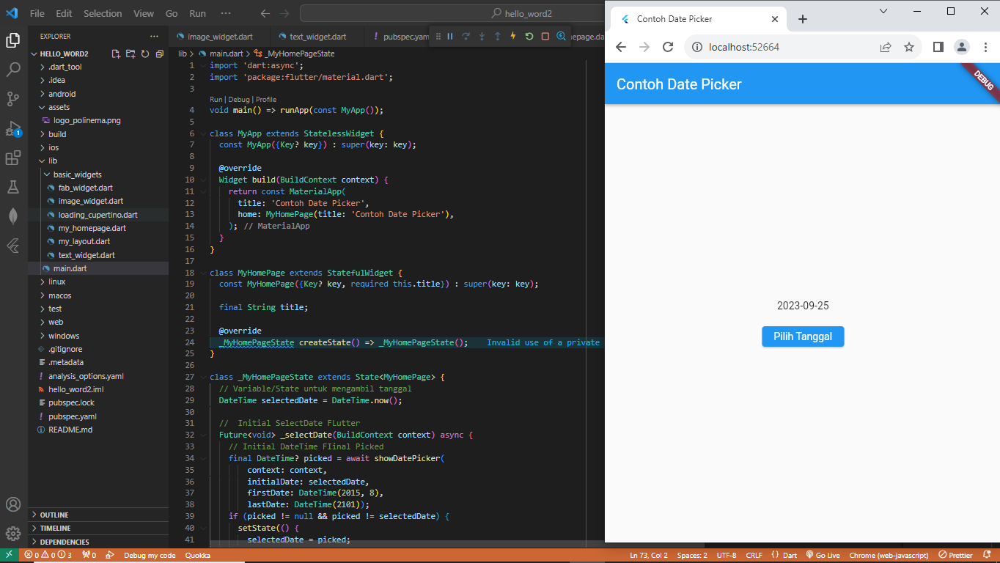

# Week 5

A new Flutter project.

# Praktikum 3
## Text Widget

mengganti isi teks dan warnanya menjadi merah.

## Image Widget

Kemudian menambahkan logo Polinema.

# Praktikum 4       
## Scaffold Widget

Implementasi scaffold widget yang digunakan untuk mengatur tata letak sesuai dengan material design.

## Dialog Widget

Menambahkan alert dialog.

## Input and Selection Widget

Menambahkan widget berupa input field untuk menerima inputan dari user, di sini saya menambahkan TextField.

## Date and Time Picker

Menambahkan date and time picker, yang dapat menerima input berupa selection (pemilihan tanggal dan waktu).

